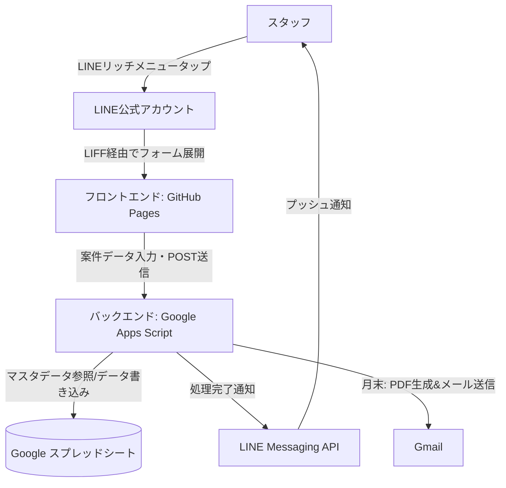

# LINE請求書自動作成システム 完全理解ガイド

本ドキュメントは、「LINE請求書自動作成システム（内部コード: LINE_INVOICE）」の全体像、仕組み、運用方法を誰でも完璧に理解できるようにまとめた総合ガイドです。

---

## 1. システムの目的と概要
ダンサー等の外注スタッフが、LINE公式アカウント（LIFFアプリ）を通じてスマートフォンのLINEアプリから日々の案件（業務）情報を簡単に登録できる仕組みです。
登録されたデータは自動的にGoogleスプレッドシートに集計され、月末の明細PDF自動生成・メール送信までを一貫して自動化します。
これにより、手作業による転記ミスをなくし、月次集計や明細書作成の大幅な業務効率化を実現します。

---

## 2. システムの全体像と4つのコア連携
本システムは、以下の4つのサービスが連携して動作します。

1. **LINE公式アカウント (Official Account Manager)**
   - スタッフ向けの窓口。トーク画面下部の「リッチメニュー」から入力フォームを呼び出します。
2. **LINE Developers (LIFFアプリ)**
   - LINEアプリ内でWebページを綺麗に開くための橋渡し（LIFF機能）を提供します。
3. **GitHub (フロントエンド)**
   - 入力フォームの画面（HTML/CSS/JavaScript）を管理し、GitHub Pagesを利用してWeb上に公開します。
4. **Google Apps Script / GAS (バックエンド ＆ データベース)**
   - フォームから送信されたデータを受け取り、Googleスプレッドシート（データベース）への書き込み、LINEへの完了通知、PDF生成を行います。

### アーキテクチャ図

---

## 3. 業務フロー

### 3.1 日々の入力フロー（スタッフ）
1. LINEのトーク画面からリッチメニューをタップし、入力フォームを開く。
2. 店舗名、日程、名前、案件名（商品名）、数量を入力する。
   - ※店舗名や案件名、スタッフ名はすべてスプレッドシートの「マスタ」から自動取得されます。
3. 送信ボタンを押す。
4. 送信完了後、LINEのトーク画面に「登録完了」の通知メッセージが届く。

### 3.2 月次の集計・処理フロー（管理者・システム）
1. **毎月1日**: GASの時間トリガーにより、自動的に「新しい月のスプレッドシート（外注連絡表）」とフォルダが生成されます。
2. **都度**: スタッフが送信したデータは該当月のスプレッドシートに自動追記され、金額計算が行われます。
3. **月末・締日**: フォーム送信時、または管理者の手動操作により、スプレッドシートのデータをもとに明細書PDFが自動生成され、マスタに登録されているスタッフのメールアドレス宛てに送信されます。

---

## 4. プロジェクトのディレクトリ構成と役割

本リポジトリ（ソースコード）は大きく分けて以下の構造になっています。

- `liff-frontend/` : **フロントエンド（画面）**
  - `index.html`など。UIの見た目と送信処理を担当。GitHub Pagesでホスティング。
- `gas/` : **バックエンド（処理）**
  - `Code.js`などのGASスクリプト。スプレッドシートへの読み書き、通知、PDF化などを担当。claspツールでGAS上にアップロードして運用。
- `docs/` : **ドキュメント類**
  - 要件定義書や運用マニュアル、本ガイドが格納されています。

---

## 5. データベース設計（スプレッドシート）

システムを稼働させるための「データベース」として2種類のスプレッドシートを使用します。

### 5.1 マスタスプレッドシート
システムの基準となる情報を管理します。
- **案件マスタ**: 案件名、現場コード、単価などを管理（フォームの選択肢になる）。
- **ダンサーマスタ**: スタッフの芸名、本名、口座情報、メールアドレスなどを管理。

### 5.2 月次スプレッドシート（テンプレートから毎月自動生成）
実際のデータが保存されるシートです。
- **2.入力表**: フロントエンドから送られた案件データが行として追記されていきます。
- **外注連絡票**: スタッフごとの請求金額、振込金額などが計算・成形されるシート（PDF化の元データ）。

---

## 6. システム運用・保守のポイント

### 6.1 マスターデータの更新
- 案件やスタッフが増減した場合、**マスタスプレッドシートを直接編集**するだけで完了です。プログラムの修正は不要で、次回フォームを開いた時に自動的に最新の選択肢が反映されます。

### 6.2 画面（フロントエンド）の修正
1. `liff-frontend/index.html` などを編集。
2. GitHubへPush（`git add .` -> `git commit` -> `git push`）。
3. GitHub Actionsにより数分で自動的に本番環境へ反映。

### 6.3 裏側の処理（GAS）の修正
1. `gas/` フォルダ内のコードを編集。
2. `clasp push` でクラウドのGASへ反映。
3. **【重要】** ロジックを大きく変更した場合は、GASエディタ上で「新しいデプロイ」として公開し直し、発行された新しいWebアプリURLを `liff-frontend/index.html` の `GAS_URL` に設定してGitHubへPushし直す必要があります。

---

## 7. よくあるトラブルと解決策

- **Q. フォームに新しいスタッフや案件名が表示されない**
  - A. マスタスプレッドシートの登録が間違っていないか確認してください。反映されない場合は、スマホブラウザのキャッシュが原因の可能性が高いため、LINEを再起動（タスクキル）して開き直してください。
- **Q. フォーム送信時にエラーになる**
  - A. GASのデプロイURLが最新になっているか（`index.html`内の`GAS_URL`が正しいか）、またはGASの権限設定が「全員」になっているかを確認してください。
- **Q. PDFメールが届かない**
  - A. ダンサーマスタに正しいメールアドレスが登録されているか確認してください。空欄の場合は送信がスキップされます。
